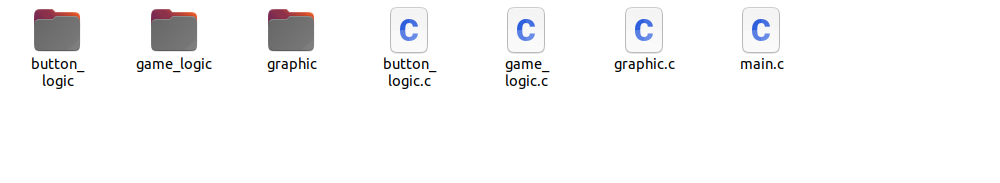
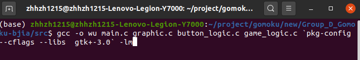

# Group_D_Gomoku

## Organization

University of Ottawa & University of Carleton


## Authors:

Bin Jia

Tingyu Ye

Hongzhi Zhang


## Project Statement

Gomoku, also called Five in a Row, is an abstract strategy board game. It is traditionally played with Go pieces (black and white stones) on a Go board. It can be played using the 15×15 board or the 19×19 board. Players alternate turns to place a stone of their colour on an empty intersection. The winner is the first player to form an unbroken chain of five stones.


## Basic Functions:

1. The main function is to achieve a two-player battle.

2. The board size should be 19*19. Each player will have different colored stones (for example player 1 will have black and player 2 will have blue). After each move, the program will check if there is a winner or not.

3. The victory condition is that when the five stones of the same player practice a straight line vertically or horizontally or diagonally, that player wins and then exits the game. You can exit the game at any time during the game.

   

## Further Functions:

1. Background music: The music will be background long music, that would be around 2 to 5 minutes. Also, we will try to add action sounds (SFX). These will give sound feedback when a player or machine plays a move and when a party wins the match.

2. Man-machine battle: The purpose of this mode's implementation is to have the player play with trained agent by implementing the reinforcement learning

   

## Description

1. The console version will provide two size boards shown like the following:

   

   After choosing the board size, player 1 can put the stone (X) on the board by inputting row and column, then change the turn, player 2 will put the stone (O) on the board by the same way, like following:

   

   If any player satisfy the victory condition, it will output who it the winner.

2. We also provide a graphic version, but this version only has a 19 * 19 board and the stones are black and blue. Player can click "Player vs Player" button to start game. Moreover, they can click "Surrender" button to surrender or click "Pause" to pause. If the player clicks quit button, he will close the window. The graphic interface looks like the following:

   


## File Structure

The file structure shown like the following:

```
├─bin
├─build
│  └─cmake-build
├─data
├─include
│  ├─button_logic
│  │  ├─button_logic.h
│  ├─game_logic
│  │  ├─game_logic.h
│  └─graphic
│  │  ├─graphic.h
├─src
│  ├─button_logic
│  │    ├─button_logic.c
│  ├─game_logic
│  │    ├─game_logic.c
│  └─graphic
│  │    ├─graphic.c
└─test
 ├─data
 ├─include
 └─src
```

- build folder contains the files generated at compile time.

- bin folder contains the executable file.

- data should contain data file we used, but we do not have any data in this project, so we put the Readme pictures in it.

- include folder contains the header files.

- src folder contains the source files.

- test folder contains the test files.

## How to use

We provide two versions of Gomoku. One is the console version, another one is the graphic version.

#### 1. Console Version

You can clone the console version using the following command:

```bash
git clone -b console_version https://github.com/Mangosata/Group_D_Gomoku.git
```

Then open a terminal in the project directory (the project folder should call Group_D_Gomoku) and  use the following command to go to the "src" folder:

``` bash
cd src
```

Finally, use this command to compile main.c:

```bash
gcc .\main.c .\game\game.c .\board\board.c -o main
```

Now, you will get a main.exe file under "src" directory, open it and play game! Have fun!

#### 2. Graphic Version

First, you need to clone this repository to your local using the following command:

```bash
git clone https://github.com/Mangosata/Group_D_Gomoku.git
```

Next, to run the graphic version, you should download and install GTK 3.0 first, here is the download link:

- For windows:
  - https://www.gtk.org/docs/installations/windows/
- For Linux:
  - https://www.gtk.org/docs/installations/linux/
- For MacOS:
  - https://www.gtk.org/docs/installations/macos/

My environment is:

- Windows 10

- CLion 2020.1.1

- GTK +3.0

- MinGW

  - Installed following GTK website https://www.gtk.org/docs/installations/windows/#using-gtk-from-msys2-packages

    Use this command`pacman -S mingw-w64-x86_64-toolchain base-devel`
    
    This package will provide a gcc and g++ for compile.

****

After you install GTK 3.0, you should add the following code (if it does not exist in CMakeList.txt) into CMakeList.txt.

```c
cmake_minimum_required(VERSION 3.16)
project(Group_D_Gomoku)

set(CMAKE_C_STANDARD 99)

find_package (PkgConfig REQUIRED)
pkg_check_modules (GTK3 REQUIRED gtk+-3.0)
include_directories (${GTK3_INCLUDE_DIRS})
link_directories (${GTK3_LIBRARY_DIRS})
add_definitions (${GTK3_CFLAGS_OTHER})
add_executable(Group_D_Gomoku src/main.c src/graphic/graphic.c include/graphic/graphic.h src/game_logic/game_logic.c include/game_logic/game_logic.h src/button_logic/button_logic.c include/button_logic/button_logic.h)
target_link_libraries (Group_D_Gomoku ${GTK3_LIBRARIES})
```

If you are using Clion, you can click "Run" button to run this program easily.


If CLion hints you don't have cmake-build-debug folder, please **Reload CMake Project** by clicking the right mouse button in project window.


If you are using other editors or IDEs in Windows and you want to run this graphical version, please follow the official tutorial https://www.gtk.org/docs/getting-started/hello-world/.


#### Run graphic version on Ubuntu
To run the program, you need to install gcc first.
Open the terminal first and then use this command line:
```bash
sudo apt-get install build-essential
```
After you install gcc and gtk3.0 you can run the programe.
Firstly, you need to copy graphic.c, game_logic.c and button_logic then paste to the folder src.



Then, because we change the path of .c file, we need to change the path of .h file in .c file.
change ../../include to ../include, for example, for game_logic.h path in game_logic.c.
original one is:
```bash
#include "../../include/game_logic/game_logic.h"
```
you need to change to:
```bash
#include "../include/game_logic/game_logic.h"
```
Next, open the terminal in src and enter the following command:

```bash
gcc -o wu main.c graphic.c button_logic.c game_logic.c 'pkg-config --cflags --libs gtk+-3.0' -lm
```


After that you should get a new file called wu. In the end, you need to enter following command and you will run the program.

```bash
./wu
```


## Detailed Instruction

If you want to read the detailed instruction, please go to our wiki page https://github.com/Mangosata/Group_D_Gomoku/wiki.

