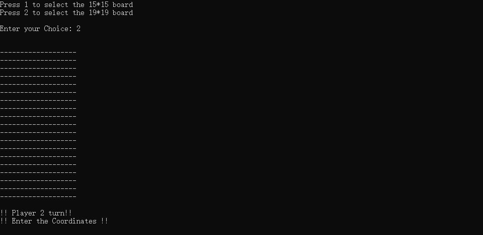
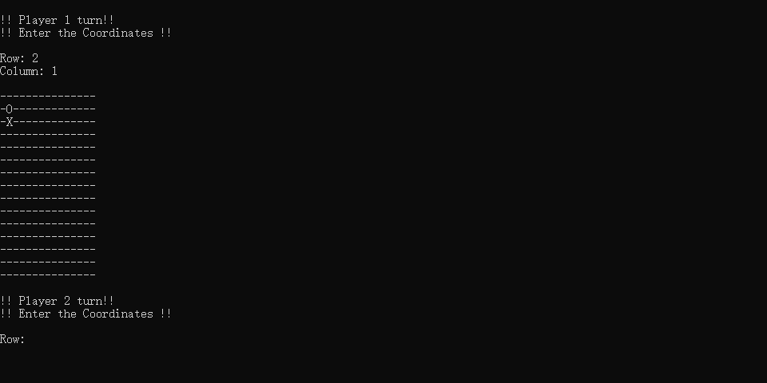
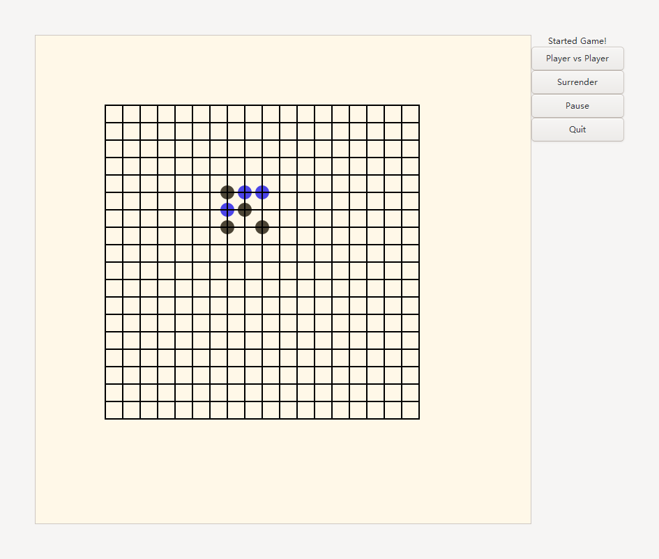
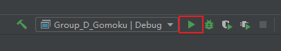
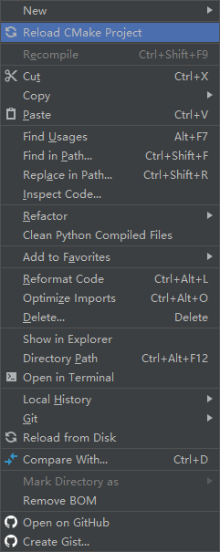

# Group_D_Gomoku

[TOC]


## Organization

University of Ottawa & University of Carleton


## Authors

Bin Jia

Tingyu Ye

Hongzhi Zhang


## Project Statement

Gomoku, also called Five in a Row, is an abstract strategy board game. It is traditionally played with Go pieces (black and white stones) on a Go board. It can be played using the 15×15 board or the 19×19 board. Players alternate turns to place a stone of their colour on an empty intersection. The winner is the first player to form an unbroken chain of five stones.


## Basic Functions:

1. The main function is to achieve a two-player battle.

2. The board size should be 19*19. Each player will have different colored stones (for example player 1 will have black and player 2 will have blue). After each move, the program will check if there is a winner or not.

3. The victory condition is that when the five stones of the same player practice a straight line vertically or horizontally or diagonally, that player wins and then exits the game. You can exit the game at any time during the game.

   

## Further Functions

1. Background music: The music will be background long music, that would be around 2 to 5 minutes. Also, we will try to add action sounds (SFX). These will give sound feedback when a player or machine plays a move and when a party wins the match.

2. Man-machine battle: The purpose of this mode's implementation is to have the player play with trained agent by implementing the reinforcement learning

   

## Description

1. The console version will provide two size boards shown like the following:

   

   After choosing the board size, player 1 can put the stone (X) on the board by inputting row and column, then change the turn, player 2 will put the stone (O) on the board by the same way, like following:

   

   If any player satisfy the victory condition, it will output who it the winner.

2. We also provide a graphic version, but this version only has a 19 * 19 board and the stones are black and blue. Player can click "Player vs Player" button to start game. Moreover, they can click "Surrender" button to surrender or click "Pause" to pause. If the player clicks quit button, he will close the window. The graphic interface looks like the following:

   


## File Structure

The file structure shown like the following:

```
├─bin
├─build
├─data
├─include
│  ├─button_logic
│  │  ├─button_logic.h
│  ├─game_logic
│  │  ├─game_logic.h
│  └─graphic
│  │  ├─graphic.h
├─src
│  ├─button_logic
│  │    ├─button_logic.c
│  ├─game_logic
│  │    ├─game_logic.c
│  └─graphic
│  │    ├─graphic.c
└─test
│  ├─data
│  ├─include
│  └─src
└─makefile
└─README.md
```

- bin folder will contain the executable file.
- build folder will contain the files generated at compile time.
- data should contain data file we used, but we do not have any data in this project, so we put the README pictures in it.
- include folder contains the header files.
- src folder contains the source files.
- test folder contains the test files (we only provides tests in console version, please move to this link to check https://github.com/Mangosata/Group_D_Gomoku/tree/console_version).

## How to use

We provide two versions of Gomoku. One is the console version, another one is the graphic version.

#### 1. Console Version

You can clone the console version using the following command:

```bash
git clone -b console_version https://github.com/Mangosata/Group_D_Gomoku.git
```

Then, please click this link to see the tutorial for console version.

https://github.com/Mangosata/Group_D_Gomoku/tree/console_version

#### 2. Graphic Version

First, you need to clone this repository to your local using the following command:

```bash
git clone https://github.com/Mangosata/Group_D_Gomoku.git
```
Next, to run the graphic version, you should download and install GTK +3.0 first (we provide a simple and fast way to install GTK +3.0 on Ubuntu, please see below for details), here is the download link:

- For windows:
  - https://www.gtk.org/docs/installations/windows/
- For Linux:
  - https://www.gtk.org/docs/installations/linux/
- For MacOS:
  - https://www.gtk.org/docs/installations/macos/
****


**Run graphic version on Ubuntu**

After you clone this repository to your local, you need to install GCC to run the program first.

Open the terminal first and then use this command line:

  ```bash
  sudo apt-get install build-essential
  ```

Then, you need to install GTK +3.0 using the following command line:

```bash
sudo apt-get install libgtk-3-dev
```

Install pkg-config:

```bash
sudo apt-get install pkg-config
```

After you install GCC and GTK +3.0, please go to the Group_D_Gomoku directory:

```bash
cd Group_D_Gomoku
```

Then just use the make command to compile this project easily:

```bash
make
```

Now, you should have some .o files in build folder and an executable file in bin folder. So you just need to open this executable main file:

```bash
./bin/main
```

DONE! You can play our Gomoku now! Have fun!

****


**Run graphic version on Windows**

Because it is so hard to config a perfect environment on Windows, we only provide a method using CLion IDE which will simplify the process of setting environment. See below for details.

For success running, I have an environment like the following:

- Windows 10

- CLion 2020.1.1

- GTK +3.0

- MinGW

  - Installed following GTK website https://www.gtk.org/docs/installations/windows/#using-gtk-from-msys2-packages

    Use this command`pacman -S mingw-w64-x86_64-toolchain base-devel`
    
    This package will provide a gcc and g++ for compile.

****

After you installed GTK 3.0, you should add the following code (if it does not exist in CMakeList.txt) into CMakeList.txt.

```c
cmake_minimum_required(VERSION 3.16)
project(Group_D_Gomoku)

set(CMAKE_C_STANDARD 99)

find_package (PkgConfig REQUIRED)
pkg_check_modules (GTK3 REQUIRED gtk+-3.0)
include_directories (${GTK3_INCLUDE_DIRS})
link_directories (${GTK3_LIBRARY_DIRS})
add_definitions (${GTK3_CFLAGS_OTHER})
add_executable(Group_D_Gomoku src/main.c src/graphic/graphic.c include/graphic/graphic.h src/game_logic/game_logic.c include/game_logic/game_logic.h src/button_logic/button_logic.c include/button_logic/button_logic.h)
target_link_libraries (Group_D_Gomoku ${GTK3_LIBRARIES})
```

If you are using Clion, you can click "Run" button to run this program easily.



If CLion hints you don't have cmake-build-debug folder, please **Reload CMake Project** by clicking the right mouse button in project window.




Now you can run the graphic interface for Gomoku. Have fun with it!


If you are using other editors or IDEs in Windows and you want to run this graphical version, please follow the official tutorial https://www.gtk.org/docs/getting-started/hello-world/.


## Detailed Instruction

**If you want to know the detailed instruction and function explanations, please go to our wiki page https://github.com/Mangosata/Group_D_Gomoku/wiki.**

